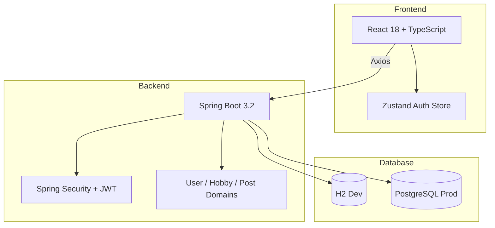

# Nazgul

> 취미 기반 소셜 매칭 플랫폼

[](https://react.dev/)
[](https://www.typescriptlang.org/)
[](https://spring.io/projects/spring-boot)
[](https://openjdk.org/)
[](https://www.postgresql.org/)
[](./LICENSE)

Nazgul은 공통 취미를 가진 사람들을 연결하기 위한 소셜 매칭 플랫폼입니다.  
사용자가 취미와 숙련도를 등록하면, 취미 겹침 정도를 기반으로 유사 사용자를 추천하고, 취미 기반 피드로 새 사용자도 바로 콘텐츠를 소비할 수 있게 설계했습니다.

## 목차

- 프로젝트 요약
- 내가 한 일
- 문제와 해결
- 주요 지표
- 스크린샷
- 아키텍처
- 프로젝트 구조

## 프로젝트 요약

| 항목 | 내용 |
|------|------|
| 유형 | Full-Stack Web Product |
| 역할 | 1인 개발 |
| 구성 | React 프론트엔드 + Spring Boot 백엔드 |
| 규모 | 3,895 LOC |
| 핵심 주제 | 취미 기반 추천, Cold Start 완화, JWT 인증 |
| 데이터 | H2(개발), PostgreSQL(운영) |

## 내가 한 일

- React + TypeScript 프론트엔드 구현
- Spring Boot + JPA 백엔드 API 구현
- JWT 인증 및 Spring Security 구성
- 취미 추천 로직과 피드 구성 설계
- DDD 기반 패키지 구조 설계
- H2 개발 환경과 PostgreSQL 운영 환경 분리

## 문제와 해결

### 취미 기반 추천

- 9개 카테고리, 44개 취미를 기준으로 사용자 간 공통 취미를 계산했습니다.
- `UserHobby` 교집합 크기를 점수화해 유사 사용자를 추천했습니다.
- 이미 팔로우한 사용자는 제외해 추천 품질을 높였습니다.

### Cold Start 피드

- 새 사용자는 팔로우 관계가 없어 피드가 비기 쉽습니다.
- 이를 해결하기 위해 **팔로우 기반 피드 + 취미 기반 피드**를 `UNION`으로 병합했습니다.
- 결과적으로 신규 사용자도 가입 직후 바로 관련 콘텐츠를 볼 수 있게 만들었습니다.

### JWT 인증

- 인증은 JWT 기반으로 구성했고, 토큰 만료 시간은 24시간으로 설정했습니다.
- `JwtAuthenticationFilter`를 `UsernamePasswordAuthenticationFilter` 앞에 배치해 인증 흐름을 안정화했습니다.
- 프론트엔드는 Zustand `persist`로 로그인 상태를 유지했습니다.

### 구조 정리

- 기능이 늘어나면서 패키지 복잡도가 커지는 문제를 막기 위해 `user`, `hobby`, `post` 3개 도메인으로 분리했습니다.
- 각 도메인 안에 entity, repository, service, controller, dto를 모아 응집도를 높였습니다.

## 주요 지표

| 항목 | 수치 |
|------|------:|
| 총 코드량 | 3,895 LOC |
| 프론트엔드 | 1,821 LOC |
| 백엔드 | 2,074 LOC |
| API 엔드포인트 | 34개 |
| 취미 카테고리 | 9개 |
| 등록 취미 | 44개 |
| DB 엔티티 | 7개 |

## 스크린샷

<p align="center">
  
  
  
</p>

<p align="center">
  
  
</p>

## 아키텍처



## 프로젝트 구조

```text
Nazgul/
├── client/   # React + TypeScript
├── server/   # Spring Boot + Java
└── docs/     # README 이미지 자산
```

## 참고 문서

- [portfolio/02-Nazgul.md](../portfolio/02-Nazgul.md)
