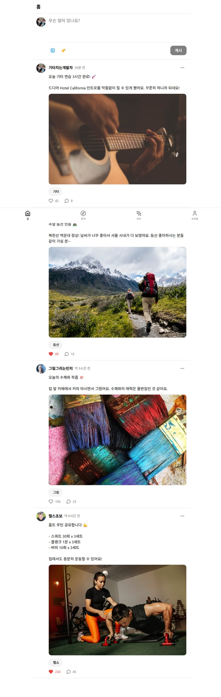
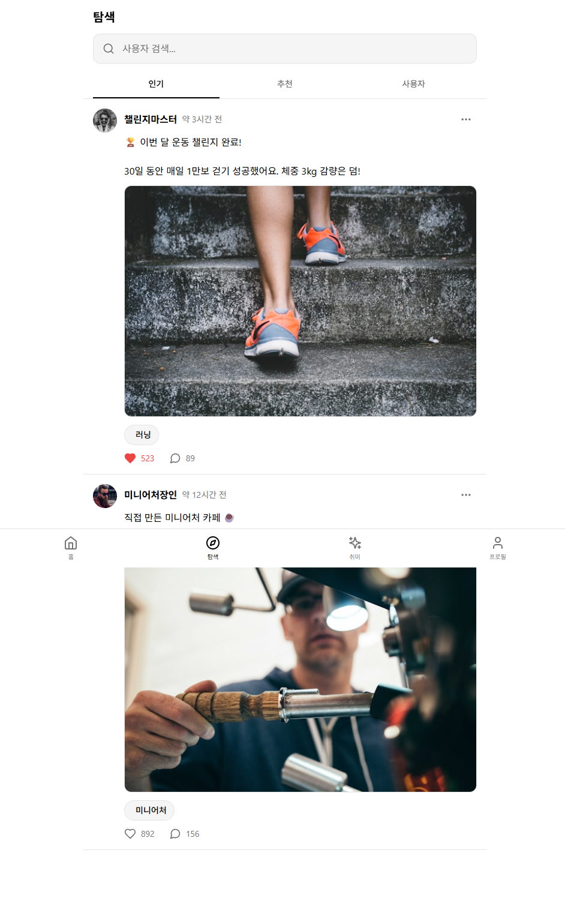
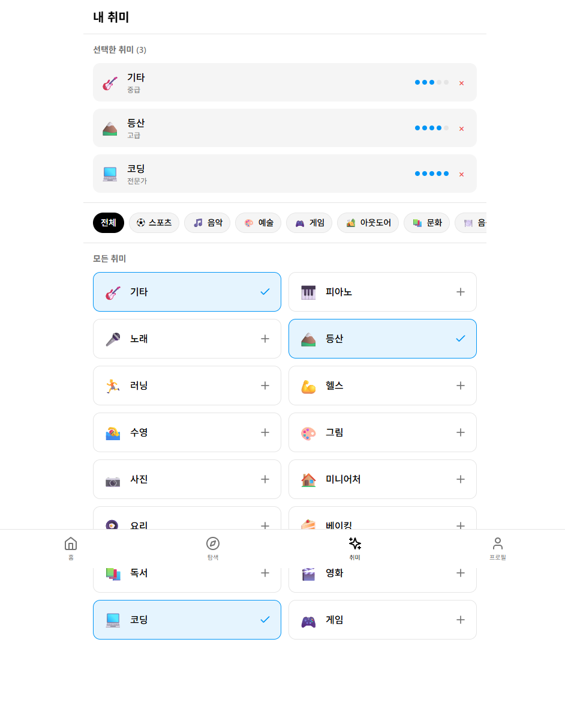
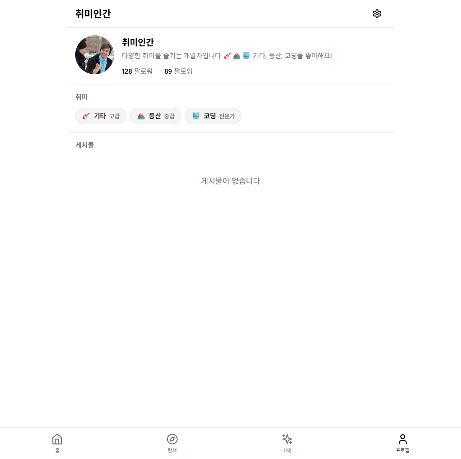
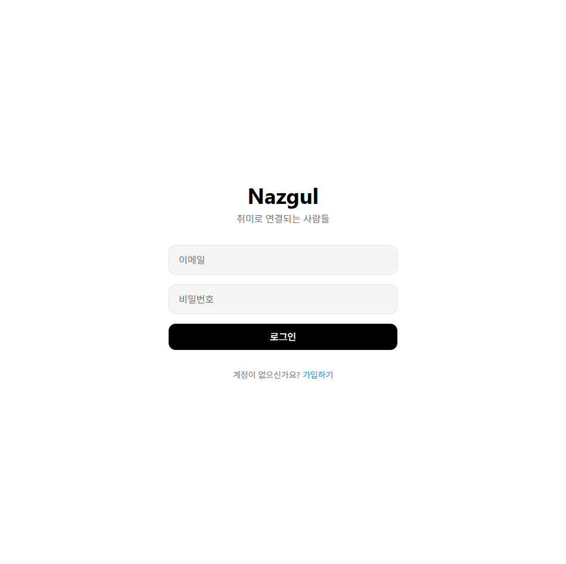

# Nazgul

취미 기반 소셜 매칭 플랫폼

**React + Spring Boot** 풀스택 프로젝트

---

## 프로젝트 구조

```
Nazgul/
├── client/          # React 프론트엔드
│   ├── src/
│   ├── package.json
│   └── README.md
└── server/          # Spring Boot 백엔드
    ├── src/
    ├── build.gradle
    └── README.md
```

## 기술 스택

| 영역 | 기술 |
|------|------|
| **Frontend** | React 18, TypeScript, Tailwind CSS, Vite, Zustand |
| **Backend** | Spring Boot 3, Java 17, JPA, PostgreSQL |
| **Design** | Threads + Notion 스타일 UI |

## 📸 스크린샷

<div align="center">
  
  
</div>
<div align="center">
  
  
</div>
<div align="center">
  
</div>

## 주요 기능

- 회원가입/로그인 (JWT 인증)
- 취미 기반 피드 (44개 취미, 9개 카테고리)
- 게시물 작성, 좋아요, 댓글
- 프로필 관리, 팔로우/팔로워
- 탐색 및 사용자 검색

## 빠른 시작

### Backend

```bash
cd server
./gradlew bootRun
# http://localhost:8080
```

### Frontend

```bash
cd client
npm install
npm run dev
# http://localhost:3000
```

## 세부 문서

- [Client README](client/README.md)
- [Server README](server/README.md)

## 라이선스

MIT License
