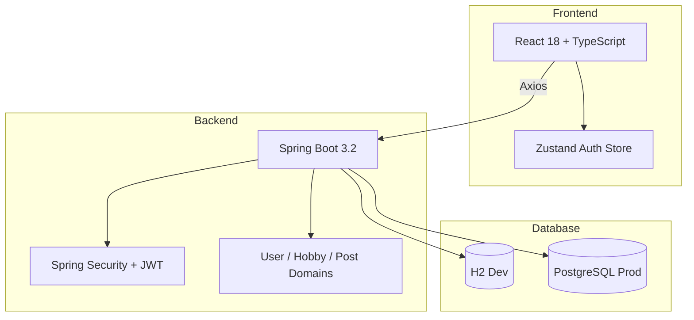

# Nazgul

> 44개 취미와 9개 카테고리를 기반으로 추천과 Cold Start 문제를 푼 소셜 매칭 플랫폼

[](https://react.dev/)
[](https://www.typescriptlang.org/)
[](https://spring.io/projects/spring-boot)
[](https://openjdk.org/)
[](https://www.postgresql.org/)
[](./LICENSE)

Nazgul은 공통 취미를 가진 사람들을 연결하기 위한 소셜 매칭 플랫폼입니다.  
사용자가 취미와 숙련도를 등록하면 취미 겹침 정도를 기반으로 유사 사용자를 추천하고, 취미 기반 피드로 새 사용자도 바로 콘텐츠를 소비할 수 있게 설계했습니다.

## 목차

- 프로젝트 요약
- 내가 한 일
- 문제와 해결
- 주요 지표
- 스크린샷
- 아키텍처
- 프로젝트 구조

## 프로젝트 요약

| 항목 | 내용 |
|------|------|
| 유형 | Full-Stack Web Product |
| 역할 | 1인 개발 |
| 구성 | React 프론트엔드 + Spring Boot 백엔드 |
| 규모 | 3,895 LOC |
| 핵심 주제 | 취미 기반 추천, Cold Start 완화, JWT 인증 |
| 데이터 | H2(개발), PostgreSQL(운영) |

## 핵심 포인트

- **추천 로직**: `UserHobby` 교집합 기반 유사 사용자 추천
- **Cold Start 완화**: 팔로우 피드와 취미 피드를 `UNION`으로 병합
- **인증 구조**: Spring Security + JWT 필터 체인 구성
- **구조 설계**: `user`, `hobby`, `post` 3개 도메인으로 분리

## 내가 한 일

- React + TypeScript 프론트엔드 구현
- Spring Boot + JPA 백엔드 API 구현
- JWT 인증 및 Spring Security 구성
- 취미 추천 로직과 피드 구성 설계
- DDD 기반 패키지 구조 설계
- H2 개발 환경과 PostgreSQL 운영 환경 분리

## 문제와 해결

| 문제 | 해결 | 결과 |
|------|------|------|
| 공통 취미 기반 추천이 필요함 | `UserHobby` 교집합 크기를 점수화하고 이미 팔로우한 사용자는 제외 | 단일 쿼리로 추천 목록 생성 |
| 새 사용자는 피드가 비기 쉬움 | **팔로우 피드 + 취미 피드**를 `UNION`으로 병합 | 가입 직후에도 관련 콘텐츠 노출 |
| JWT 인증 흐름이 꼬일 수 있음 | `JwtAuthenticationFilter`를 필터 체인 앞단에 배치 | 인증 흐름 안정화 |
| 기능 증가로 구조가 복잡해짐 | `user`, `hobby`, `post` 3개 도메인으로 분리 | 도메인별 응집도와 탐색성 향상 |

## 구현 포인트

- 취미 데이터는 서버 시작 시 `DataInitializer`로 44개를 자동 로드
- 숙련도는 1~5 단계로 관리해 단순 관심사보다 더 세분화된 추천이 가능하도록 구성
- 프론트엔드는 Zustand `persist`로 로그인 상태를 유지
- 개발 환경은 H2, 운영 환경은 PostgreSQL로 분리

## 주요 지표

| 항목 | 수치 |
|------|------:|
| 총 코드량 | 3,895 LOC |
| 프론트엔드 | 1,821 LOC |
| 백엔드 | 2,074 LOC |
| API 엔드포인트 | 34개 |
| 취미 카테고리 | 9개 |
| 등록 취미 | 44개 |
| DB 엔티티 | 7개 |
| 인증 방식 | JWT (24h TTL) |

## 스크린샷

<p align="center">
  
  
  
</p>

<p align="center">
  
  
</p>

## 아키텍처



## 기술 선택

- **React + TypeScript**: 화면 단위 반복 개발과 타입 안정성을 같이 확보
- **Spring Boot**: 인증, JPA, API 구조를 빠르게 통합
- **Zustand**: 작은 규모 프론트엔드에서 인증 상태를 단순하게 유지
- **PostgreSQL**: 운영 환경에서 관계형 데이터와 제약 조건을 명확하게 관리

## 프로젝트 구조

```text
Nazgul/
├── client/   # React + TypeScript
├── server/   # Spring Boot + Java
└── docs/     # README 이미지 자산
```

## 참고 문서

- [portfolio/02-Nazgul.md](../portfolio/02-Nazgul.md)
